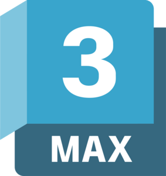

<h1 style="font-size: 3em; margin-bottom: 0px;">Tristan Anglin</h1>

  <strong>Game Developer | Systems Architect & UI Designer</strong>

  &nbsp;
  &nbsp;
  
   
  &nbsp;
  &nbsp;
  &nbsp;
  

---

Games are my foundation. I grew up in a "game family" with a collection of over 300 board games—an environment that gave me a deep, intuitive understanding of mechanics and balance long before I wrote my first line of code.

That journey began in high school, where I built my first games in Python on an iPad. I eventually taught myself Java to develop Your Dark Side while studying Computer Science and Engineering, but I soon realized my true calling wasn't just in general engineering—it was in the technical architecture and creative heart of game design.

Since shifting my focus entirely to Game Development in 2023, I’ve maintained a 3.85 GPA and dedicated myself to building a portfolio centered on engaging gameplay loops and persistent progression systems.

<b>Engines & Programming</b>

  
  
  
  
  
  

<b>Workflow & Version Control</b>

  
  
  
  
  

<b>Development Environments</b>

  
  
  

<b>Art, Audio & UI Design</b>

  
  
  
  
  
  

---

  <strong>Featured Projects</strong>
   
   
  
  
  
  
  

---

  
  

  <b>3D Co-op Musou RPG</b>
  <b>Lead UI & Systems Developer</b>

A high-action capstone project developed by an 11-person team. I led the systems architecture, utilizing <b>Jira</b> for agile sprint management and <b>GitHub</b> for version control to synchronize workflows across art, design, and programming departments.

  
  
<i>(Click to watch gameplay trailer)</i>

### Core Contributions

  <b>UI/UX Architecture</b> 
  Engineered a modular UI framework using <b>Unreal UMG</b>. This included a dynamic HUD and complex data-bound menu systems designed to scale across multiple resolutions and game states.

  <b>Networked Systems</b> 
  Implemented server-authoritative <b>RPCs</b> for critical non-combat interactions, ensuring secure data handling and synchronized game states across all clients.

  <b>Lobby & Session Management</b> 
  Architected the backend networking logic for a seamless 4-player co-op experience, handling session hosting, searching, and player handshakes.

  <b>Data-Driven Inventory</b> 
  Developed a custom inventory and loot framework from the ground up, prioritizing networked persistence and efficient server-client replication.

### Team Integration & Collaboration

  <b>Version Control & Agile Workflow</b> 
  Coordinated with a team of 11 using GitHub for repository management and <b>Jira</b> for task tracking, maintaining build stability and ensuring efficient code integration.

  <b>Systems Interoperability</b> 
  Acted as a technical bridge, ensuring UI and Networking frameworks integrated successfully with systems like <b>Procedural Level Generation</b>.

<a href="#top">↑ Back to Top</a>

  
  

  <b>2D Tile-Based Strategy TD</b>
  <b>Solo Developer</b>

A technical exercise in engine-level programming, built from the ground up using C++ and OpenGL. The project focused on efficient spatial partitioning and real-time path manipulation within a custom rendering pipeline.

  
  
<i>(Click to watch gameplay trailer)</i>

### Core Contributions

  <b>Custom OpenGL Engine</b> 
  Developed a lightweight 2D rendering engine using C++, implementing shader management, texture mapping, and a camera system to handle dynamic game scaling.

  <b>Dynamic Pathfinding</b> 
  Engineered a tile-based grid system utilizing the A* Search Algorithm, allowing enemies to recalculate paths in real-time as the player places or removes walls and towers.

  <b>Grid & Placement Logic</b> 
  Built a robust snapping and validation system for player-built structures, ensuring towers and obstacles interact correctly with the navigation mesh and enemy hitboxes.

<a href="#top">↑ Back to Top</a>

  
  

  <b>2D Tile-Based Fantasy RPG</b>
  <b>Solo Developer</b>

Built entirely from the ground up in Java, Your Dark Side represents my final major project before transitioning into formal game development studies. Driven by pure passion and self-teaching, it served as a technical playground for implementing the core pillars of the RPG genre—including complex state management, A* pathfinding, and integrated merchant economies.

  
  
<i>(Click to watch gameplay trailer)</i>

### Core Contributions

  <b>Modular Class Framework</b> 
  Engineered a multi-class selection system that serves as the foundation for character state management and attribute scaling.

  <b>Inventory & Economy Logic</b> 
  Developed a robust inventory system and NPC interaction framework supporting merchant economies, including item valuation and buying/selling logic.

  <b>A* Pathfinding Implementation</b> 
  Integrated advanced pathfinding algorithms for enemy AI to ensure intelligent navigation through complex tile-based environments.

  <b>Spell Framework</b> 
  Designed an extensible spell and ability system architecture, allowing for easy integration of new combat mechanics and visual effects.

  <b>Interactive Minimap</b> 
  Developed a functional minimap system featuring real-time player and enemy tracking and dynamic zoom-in/out capabilities.

<a href="#top">↑ Back to Top</a>

  
  

  <b>2D Dungeon Crawler RPG</b>
  <b>Solo Developer</b>

This project represents my first deep dive into the RPG genre and complex system architecture. Developed entirely on an iPad, this was an ambitious leap from previous work, driven by a passion for dungeon crawlers. It stands as a milestone where I successfully implemented interlocking systems like inventory management, class-based stats, and enemy AI.

  
  
<i>(Click to watch gameplay trailer)</i>

### Core Contributions

  <b>RPG Systems Architecture</b> 
  Designed and implemented a class selection scene featuring 8 unique character classes, each with distinct starting attributes.

  <b>Combat & Enemy AI</b> 
  Developed a real-time combat system where enemies utilize homing logic to track and engage the player with 8-directional movement.

  <b>Loot & Progression Logic</b> 
  Scripted a reward system where defeated enemies trigger XP, gold, and item drops, feeding into a persistent inventory and leveling system.

  <b>UI/UX Prototyping</b> 
  Built a multi-scene menu flow, including a dungeon selection interface and a functional inventory management screen.

<a href="#top">↑ Back to Top</a>

  
  

  <b>2D Survival Endless Scroller</b>
  <b>Solo Developer</b>

As my first step into game development, Hit & Run was built in Python on the iPad to explore the core architecture of a functional game loop. This project served as my primary classroom for learning scaling difficulty and persistent progression systems—foundational concepts that have informed every project since.

  
  
<i>(Click to watch gameplay trailer)</i>

### Core Contributions

  <b>Survival Loop Architecture</b> 
  Engineered a stationary combat loop where enemies continuously converge on a fixed player position.

  <b>Combat Mechanics</b> 
  Implemented a non-targeting swing mechanic that damages all enemies within a frontal arc and integrated a real-time cooldown system tied to a "Haste" stat.

  <b>Persistent Progression</b> 
  Engineered a multi-tiered reward system and a comprehensive shop framework allowing players to permanently upgrade base stats and manage rare currency for ability unlocks.

<a href="#top">↑ Back to Top</a>

